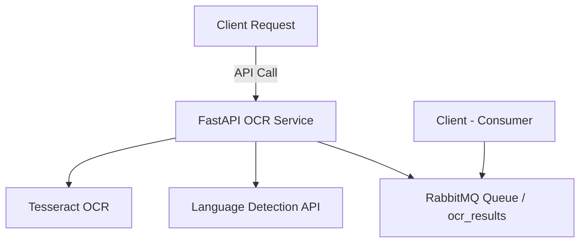
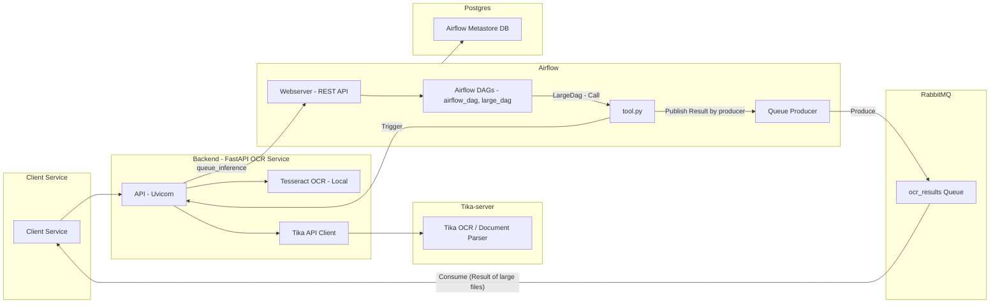

# 📄 OCR Service
[](https://fastapi.tiangolo.com/)  
[](https://www.docker.com/)  
[](https://github.com/tesseract-ocr/tesseract)  


An OCR (Optical Character Recognition) service that extracts text from images and from images embedded in documents (DOCX, PPTX, PDF, etc.), and detects the language of the extracted text.
The service uses:
- **FastAPI** for the REST API
- **Tesseract OCR** for text extraction
- **Custom Language Detection API** for language identification

---

## 🚀 Getting Started

### 1️⃣ Create `.env` file
Create a `.env` file in the root directory.  
You can use [`example_env.txt`](example_env.txt) as a reference.

---

### 2️⃣ Start the Services
From the project root, run:
```bash
docker compose up --build -d
```

---

## 🌐 Available Services

| Service           | URL                                         | Credentials       |
|-------------------|---------------------------------------------|-------------------|
| **Backend Docs**  | [http://localhost:8282/docs](http://localhost:8282/docs) | Token required   |
| **Airflow UI**    | [http://localhost:8080](http://localhost:8080)           | admin / admin   |
| **RabbitMQ UI**   | [http://localhost:15672](http://localhost:15672)         | admin / admin   |

> 📝 Airflow credentials can be changed in the `.env` file.

---

## 📨 RabbitMQ Consumer-Client Samples
RabbitMQ consumers are available in [`client_sample`](doc/client_sample) directory:
- [`consume.py`](doc/client_sample/consume.py)  
- [`consume2.py`](doc/client_sample/consume2.py) (if the first one doesn't work)

---
## 📤 Example API Requests

### 1. Direct Inference (Synchronous)
```bash
curl --location 'http://localhost:8282/ocr/inference' --header 'Content-Type: application/json' --header 'Authorization: Bearer YOUR_TOKEN' --data '{
  "url": "https://cf2.ppt-online.org/files2/slide/s/sEJXuRQk0xK4tH3ilIL1AMTB87dOmwcybo6aFSfpN/slide-0.jpg"
}'
```
* The maximum allowed file size is 50 MB
  
---

### 2. Queue Inference (Asynchronous)
```bash
curl --location 'http://localhost:8282/ocr/queue_inference' --header 'Content-Type: application/json' --header 'Authorization: Bearer YOUR_TOKEN' --data '{
   "url": "https://yourpositiveoasis.com/wp-content/gallery/25-inspiring-and-positive-quotes/IMG_7101.PNG",
   "local_path": "",
   "request_id": "string_5",
   "file_size_mb": 3,
   "callback_url": "https://webhook-test.com/ba547e1d07c3133881c8a516ca338cb1"
}'
```
➡ The response will be `"received"`. The result can be retrieved by listening to RabbitMQ on channel `ocr_results`.

---

## 📑 Supported File Formats
- `jpeg`
- `jpg`
- `png`
- `gif`
- `bmp`
- `pdf`

---

## 📌 Architecture Overview


---
## 🛠 Docker Compose Setup

## 🏗 Architecture Overview

The OCR Service is composed of several connected components that work together for text extraction, document parsing, and workflow orchestration.



---

## 🛠 Tech Stack
- **Backend:** FastAPI
- **OCR Engine:** Tesseract
- **Queue:** RabbitMQ
- **Workflow Orchestration:** Airflow
- **Containerization:** Docker

---